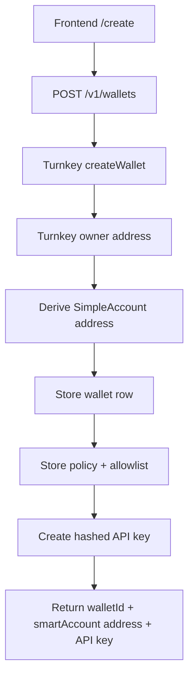
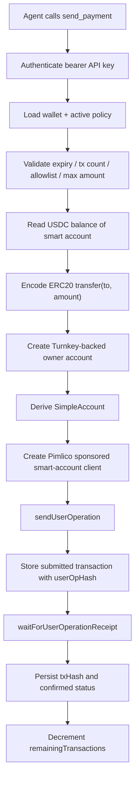

# Architecture

This document explains how SpongeWallet works internally.

## Components

There are five major runtime pieces:

1. frontend
2. backend
3. Turnkey
4. Base Sepolia
5. Pimlico

## Address model

There are two addresses that matter:

### Owner address

This is the Turnkey-controlled EOA used to own and sign for the smart account.

It is stored in the backend database as `ownerAddress`.

### Smart account address

This is the `SimpleAccount` address derived from the Turnkey owner.

It is:

- shown in the UI
- returned as `address` in wallet APIs
- the address the user funds with USDC
- the address whose USDC balance is checked

The system only works cleanly if this distinction remains clear.

## External providers

### Turnkey

Turnkey is used for:

- creating the owner wallet/account
- exposing a signer compatible with `viem`

The backend does not persist raw private keys.

### Pimlico

Pimlico is used for:

- bundling user operations
- paymaster sponsorship
- fee estimation for user operations

### Base Sepolia RPC

The backend still needs a healthy RPC endpoint because it performs:

- USDC `balanceOf` reads
- smart-account related chain reads
- simulation-dependent client calls

If the RPC is down or heavily rate-limited, the send flow can fail even if Turnkey and Pimlico are healthy.

## Wallet creation flow

## Send flow

## Policy model

Policy is intentionally enforced by the application backend, not the chain.

This keeps the MVP simpler but means:

- the backend is the trust/control layer
- policy checks must stay correct
- agent prompts and skill docs must reflect backend behavior exactly

Current policy fields:

- `expiresAt`
- `maxTransactions`
- `remainingTransactions`
- `maxAmountPerTxUsdc`
- `allowedRecipients[]`

## Persistence model

The backend stores:

- wallet metadata
- API key hashes
- policies
- allowlist entries
- transaction history

The backend does not store:

- raw private keys
- plaintext API keys after creation

## Interfaces

### REST

REST is the operator and fallback integration surface.

### MCP

MCP is the primary agent interface.

The backend spins up an MCP server per request and authenticates the bearer token before exposing tools.

### OpenClaw skill

The `skill.md` file is generated dynamically from wallet and policy data so the instructions match the actual wallet state.

## Failure boundaries

### Turnkey failure

Breaks:

- wallet creation
- owner signer creation
- any send path requiring owner signing

### Pimlico failure

Breaks:

- sponsored send submission
- user operation sponsorship

### RPC failure

Breaks:

- balance reads
- smart-account reads and simulations
- preflight chain interactions

### Policy failure

Returns controlled `400`-class application errors.

## Architectural tradeoffs

### Why smart account + Pimlico

- no ETH required in the wallet
- standard ERC-20 transfer path
- good fit for AI-agent UX

### Why still keep backend policy enforcement

- faster MVP
- easy allowlist and tx-count rules
- avoids building on-chain permissions in this phase

### What this means

This is an AA-powered wallet product, but not a trustless self-serve wallet.
It is still a managed agent wallet with a backend control layer.
